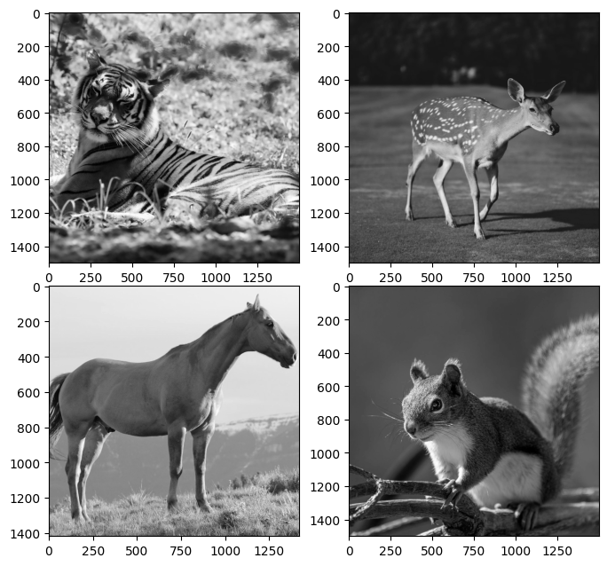
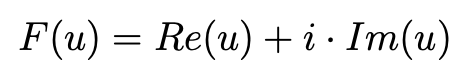
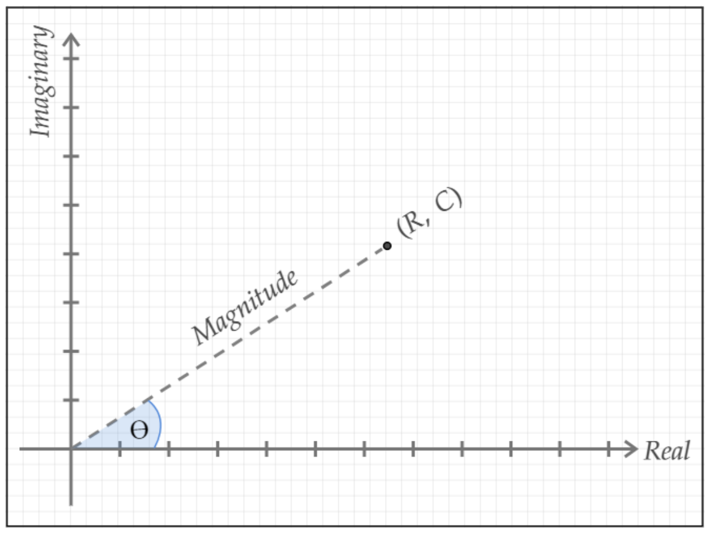
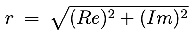
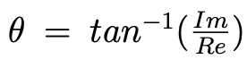
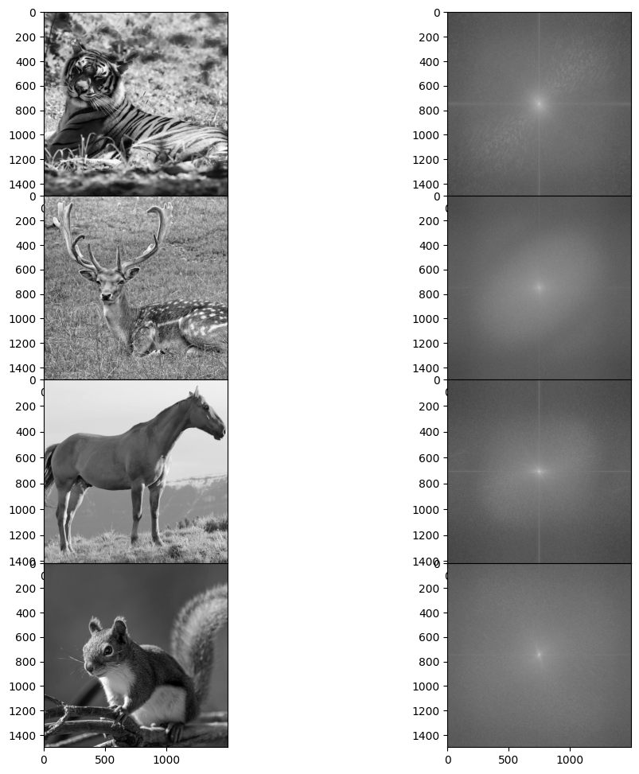
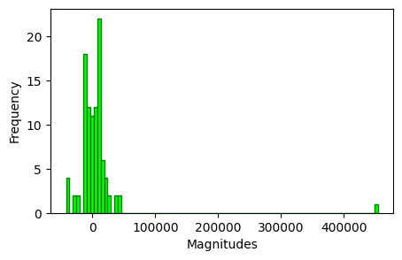
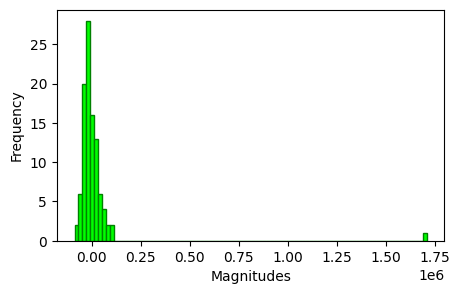
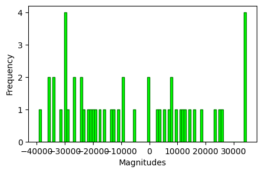
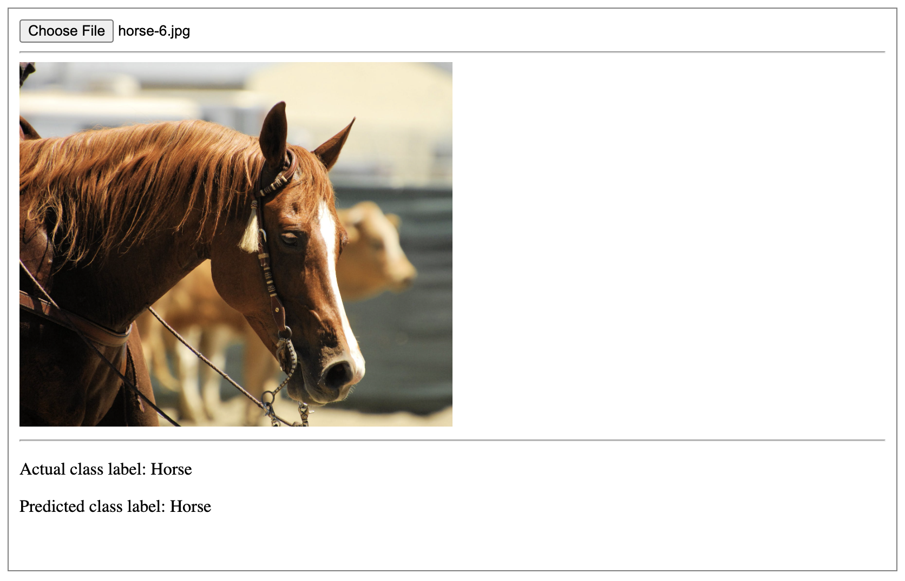

## Perform feature engineering using FFT and generate custom features of images to train an image classifier
<hr>

In this project, a collection of custom fourier space features are generated in order to train and test a neural network classifier instead of using image pixel values for the training. The image pre-processing steps contain several FFT-based feature engineering tasks that generate the following custom features:
* Fourier co-efficients
* Magnitude
* Phase angle and
* Sector index 

These extracted features are then directly used for training a neural network classifier. 
The feature engineering process is explained in the following exploratory data analysis section.

### Exploratory Data Analysis:


```python
from matplotlib import pyplot as plt
from skimage import io

from dataset import *
from fft import *
```

The input images used in this project are of different shape as shown below.


```python
image_np_dict, class_labels = load_images()

for label, data in image_np_dict.items():
    print(f'INFO: sample {label} data shape: {data[0].shape}')
```

    INFO: reading images..
    INFO: reading images complete
    INFO: sample deer data shape: (1500, 1500)
    INFO: sample horse data shape: (1000, 1000)
    INFO: sample squirrel data shape: (1500, 1500)
    INFO: sample tiger data shape: (1500, 1500)


```python
plt.rcParams["figure.figsize"] = (8,8)
f, axarr = plt.subplots(2, 2, gridspec_kw = {'hspace':0})
axarr[0,0].imshow(image_np_dict['tiger'][0], cmap='gray')
axarr[0,1].imshow(image_np_dict['deer'][0], cmap='gray')
axarr[1,0].imshow(image_np_dict['horse'][4], cmap='gray')
axarr[1,1].imshow(image_np_dict['squirrel'][0], cmap='gray')

print('INFO: class labels: tiger, deer, horse squirrel')
```

    INFO: class labels: tiger, deer, horse squirrel


    

    


FFT (Fast Fourier Transform) algorithm is applied to each image that will generate a set of fourier co-efficients. Each co-efficient is complex-valued and is a combination of a real part Re(u)
and an imaginary part Im(u).



The magnitude and phase angle of a signal can be described by these real and imaginary
components. If we plot a complex-valued F(u) in a polar coordinate form (Re, Im), then
the magnitude is the Euclidean distance between the center and the plotted point.



The phase angle θ is the amount of clockwise rotation of the plotted point from the positive real
axis. 
The magnitude r and phase angle θ can be computed using the following equations.




The following function call will compute the fourier co-efficients and magnitudes for each image.


```python
coefficients_np_dict, mag_np_dict = compute_fourier_coefficients_and_magnitude(image_np_dict)

print(f'\nINFO: sample fourier co-efficient: {coefficients_np_dict["deer"][0][0][0]}')
print(f'\nINFO: sample magnitude: {mag_np_dict["deer"][0][0][0]}')
```

    INFO: computing fourier coefficients of deer data
    INFO: computing fourier coefficients of horse data
    INFO: computing fourier coefficients of squirrel data
    INFO: computing fourier coefficients of tiger data
    INFO: computing fourier coefficients complete
    
    INFO: sample fourier co-efficient: (-9.68761137254899-1.3322676295501878e-15j)
    
    INFO: sample magnitude: 9.68761137254899


The diagram below show images for different class labels and their corresponding magnitude.


```python
plt.rcParams["figure.figsize"] = (12,12)
f, axarr = plt.subplots(4, 2, gridspec_kw = {'hspace':0})
axarr[0,0].imshow(image_np_dict['tiger'][0], cmap='gray')
axarr[0,1].imshow(np.log(mag_np_dict['tiger'][0]), cmap='gray')
axarr[1,0].imshow(image_np_dict['deer'][4], cmap='gray')
axarr[1,1].imshow(np.log(mag_np_dict['deer'][4]), cmap='gray')
axarr[2,0].imshow(image_np_dict['horse'][4], cmap='gray')
axarr[2,1].imshow(np.log(mag_np_dict['horse'][4]), cmap='gray')
axarr[3,0].imshow(image_np_dict['squirrel'][0], cmap='gray')
axarr[3,1].imshow(np.log(mag_np_dict['squirrel'][1]), cmap='gray')
```


    <matplotlib.image.AxesImage at 0x7f7b0822cc40>


    

    


The reason for feature engineering in this project is to extract fourier co-efficients and other features and use these features for training neural network classifiers for image prediction. In the above magnitude images, the bright areas contain most of the information of the respective images. If we extract the values of these bright areas only and compute the magnitude, phase angle and sector index, then we can have a meaningful feature set that is smaller than the collection of original image pixels. Thus, training image classifiers using these extracted features can reduce the overall training time. A fixed number of co-efficients are extracted for each image in this project. The following histogram shows how fourier magnitude values are distributed.


```python
flatten_coeff_dict, flatten_mag_dict = flatten_and_sort_coefficients_and_magnitudes(coefficients_np_dict, mag_np_dict)
gripped_data_dict = grip_first_n_items(flatten_coeff_dict, 100)
```

    INFO: flattening and sorting deer data
    INFO: flattening and sorting horse data
    INFO: flattening and sorting squirrel data
    INFO: flattening and sorting tiger data
    INFO: processing complete
    INFO: gripping date of deer - limit: 100
    INFO: gripping date of horse - limit: 100
    INFO: gripping date of squirrel - limit: 100
    INFO: gripping date of tiger - limit: 100
    INFO: processing complete


```python
# plotting a histogram a sample deer image
plt.rcParams["figure.figsize"] = (5,3)
plt.hist(gripped_data_dict['horse'][0], bins=90, color='lime', edgecolor='green')
plt.xlabel('Magnitudes')
plt.ylabel('Frequency')
plt.show()
```


    

    


```python
# plotting a histogram a sample tiger image
plt.rcParams["figure.figsize"] = (5,3)
plt.hist(gripped_data_dict['tiger'][0], bins=90, color='lime', edgecolor='green')
plt.xlabel('Magnitudes')
plt.ylabel('Frequency')
plt.show()
```


    

    


```python
# plotting a histogram a sample tiger image
plt.rcParams["figure.figsize"] = (5,3)
plt.hist(gripped_data_dict['tiger'][0][50:], bins=90, color='lime', edgecolor='green')
plt.xlabel('Magnitudes')
plt.ylabel('Frequency')
plt.show()
```


    

    


In the last histogram above, the first 50 coefficients are ignored. In most of the cases, the value of the first co-efficient magnitude is way higher than the others and it contains a lot more information compared to the others. The last co-efficient in the list will contain the least amount of information. Thus, the first N number of co-efficients can be considered to compute the magnitude and other features that can be directly used for training the classifiers. 

### Building and Training Neural Network Model:

#### View model parameters:


```python
import tensorflow as tf
import keras
from model import *

model = build_model_for_custom_fft_features()
model.summary()
```

    
    Model: "sequential"
    _________________________________________________________________
     Layer (type)                Output Shape              Param #   
    =================================================================
     flatten (Flatten)           (None, 16384)             0         
                                                                     
     dense (Dense)               (None, 1024)              16778240  
                                                                     
     dense_1 (Dense)             (None, 1024)              1049600   
                                                                     
     dropout (Dropout)           (None, 1024)              0         
                                                                     
     dense_2 (Dense)             (None, 512)               524800    
                                                                     
     dropout_1 (Dropout)         (None, 512)               0         
                                                                     
     dense_3 (Dense)             (None, 512)               262656    
                                                                     
     dropout_2 (Dropout)         (None, 512)               0         
                                                                     
     dense_4 (Dense)             (None, 256)               131328    
                                                                     
     dropout_3 (Dropout)         (None, 256)               0         
                                                                     
     dense_5 (Dense)             (None, 128)               32896     
                                                                     
     dropout_4 (Dropout)         (None, 128)               0         
                                                                     
     dense_6 (Dense)             (None, 64)                8256      
                                                                     
     dropout_5 (Dropout)         (None, 64)                0         
                                                                     
     dense_7 (Dense)             (None, 16)                1040      
                                                                     
     dense_8 (Dense)             (None, 4)                 68        
                                                                     
    =================================================================
    Total params: 18788884 (71.67 MB)
    Trainable params: 18788884 (71.67 MB)
    Non-trainable params: 0 (0.00 Byte)
    _________________________________________________________________
    


### Model Training:

The model training process can be started directly by calling the TRAIN function in run.py file.

Alternatively, the model can be trained by first gathering all features data by calling get_dataset_features_and_labels() function and then calling train() or train_custom_fft_features() functions.


```python
"""
this function is included here just to visualize the different steps the function call 
in order to get the complete feature list. The actual function is implemented in fft.py file.
"""
def get_dataset_features_and_labels():
    """
    make function calls and compute needed features and class labels
    """
    print(f"{'-'*15} LOADING IMAGES {'-'*15}")
    image_np_dict, class_labels = load_images()

    print(f"{'-'*15} COMPUTE FOURIER COEFFICIENTS {'-'*15}")
    coefficients_np_dict, mag_np_dict = compute_fourier_coefficients_and_magnitude(image_np_dict)

    print(f"{'-'*15} FLATTEN AND SORT MAGNITUDE {'-'*15}")
    flatten_coeff_dict, flatten_mag_dict = flatten_and_sort_coefficients_and_magnitudes(coefficients_np_dict, mag_np_dict)

    print(f"{'-'*15} DATA SAMPLING {'-'*15}")
    sample_sizes = {
        # 64: (8, 8),
        # 256: (16, 16),
        # 1024: (32, 32),
        # 4096: (64, 64),
        # 16384: (128, 128),
        65536: (256, 256),
        # 262144: (512, 512)
    }
    n_samples = get_normalized_n_data_samples(flatten_coeff_dict, flatten_mag_dict, sample_sizes, [])

    print(f"{'-'*15} COMPUTING CUSTOM FFT FEATURES {'-'*15}")
    # get mag with custom features
    # total features: [mag, angle, sector, distance]
    # for 256,256 shape: [65536, 65536, 65536, 65536]
    train_custom_features_dict, test_custom_features_dict = compute_fft_custom_features(coefficients_np_dict)

    print(f"{'-'*15} TRAIN TEST SPLIT {'-'*15}")
    trainset_size_wise, train_labels_size_wise, testset_size_wise, test_labels_size_wise = train_test_split(
        n_samples
    )
    print('INFO: data processing complete!')

    return {
        'n_samples': n_samples, 'image_np_dict': image_np_dict, 'class_labels': class_labels,
        'coefficients_np_dict': coefficients_np_dict, 'mag_np_dict': mag_np_dict,
        'flatten_coeff_dict': flatten_coeff_dict, 'flatten_mag_dict': flatten_mag_dict,
        'trainset_size_wise': trainset_size_wise, 'train_labels_size_wise': train_labels_size_wise,
        'testset_size_wise': testset_size_wise, 'test_labels_size_wise': test_labels_size_wise,
        'train_custom_features_dict': train_custom_features_dict, 'test_custom_features_dict': test_custom_features_dict
    }

features_dict = get_dataset_features_and_labels()
```

    --------------- LOADING IMAGES ---------------
    INFO: reading images..
    INFO: reading images complete
    --------------- COMPUTE FOURIER COEFFICIENTS ---------------
    INFO: computing fourier coefficients of deer data
    INFO: computing fourier coefficients of horse data
    INFO: computing fourier coefficients of squirrel data
    INFO: computing fourier coefficients of tiger data
    INFO: computing fourier coefficients complete
    --------------- FLATTEN AND SORT MAGNITUDE ---------------
    INFO: flattening and sorting deer data
    INFO: flattening and sorting horse data
    INFO: flattening and sorting squirrel data
    INFO: flattening and sorting tiger data
    INFO: processing complete
    --------------- DATA SAMPLING ---------------
    INFO: sampling and normalization complete
    --------------- COMPUTING CUSTOM FFT FEATURES ---------------
    INFO: computing fourier space custom features including magnitude
    INFO: processing complete
    --------------- TRAIN TEST SPLIT ---------------
    INFO: data processing complete!


```python
from train import *

train(features_dict)
```

    INFO: training for DIM: (128, 128)
    trainset shape: (28, 128, 128)
    train label shape: (28,)
    Epoch 1/10
    1/1 [==============================] - 2s 2s/step - loss: 0.5863 - accuracy: 0.5143
    ...
    ...
    Epoch 10/10
    1/1 [==============================] - 0s 396ms/step - loss: 0.3883 - accuracy: 0.7500

    INFO: training for DIM: (256, 256)
    trainset shape: (28, 256, 256)
    train label shape: (28,)
    Epoch 1/10
    1/1 [==============================] - 3s 3s/step - loss: 0.4863 - accuracy: 0.5857
    ...
    ...
    Epoch 10/10
    1/1 [==============================] - 1s 729ms/step - loss: 0.3266 - accuracy: 0.8143


##### Train by calling train_custom_fft_features() function. 


```python
train_custom_fft_features(features_dict)
```

    INFO: training for custom fft features
    INFO: training for custom fft features
    INFO: training for custom fft features
    INFO: training for custom fft features
    tiger
    trainset shape: (28, 4, 4096)
    train label shape: (28,)
    Epoch 1/10
    14/14 [==============================] - 4s 187ms/step - loss: 0.4520 - accuracy: 0.6786
    ...
    ...
    Epoch 10/10
    14/14 [==============================] - 3s 205ms/step - loss: 0.3102 - accuracy: 0.8257


### Evaluate Model Accuracy:


```python
from test import *

evaluate_custom_fft_features_accuracy(features_dict)
```

    INFO: class label: deer
    trainset shape: (3, 4, 4096)
    train label shape: (3,)
    1/1 - 0s - accuracy: 0.7725 - 274ms/epoch - 274ms/step
    INFO: test accuracy: 0.7725

    INFO: class label: horse
    trainset shape: (3, 4, 4096)
    train label shape: (3,)
    1/1 - 0s - accuracy: 0.8993 - 246ms/epoch - 246ms/step
    INFO: test loss: 1.3772073984146118, test accuracy: 0.8993

    INFO: class label: squirrel
    trainset shape: (3, 4, 4096)
    train label shape: (3,)
    1/1 - 0s - accuracy: 0.8433 - 252ms/epoch - 252ms/step
    INFO: test loss: 1.3950179815292358, test accuracy: 0.8433

    INFO: class label: tiger
    trainset shape: (3, 4, 4096)
    train label shape: (3,)
    1/1 - 0s - accuracy: 0.7994 - 245ms/epoch - 245ms/step
    INFO: test loss: 1.3827837705612183, test accuracy: 0.7994


### Make Inference using the Trained Model


```python
from inference import *

extract_results_from_prediction()
```

    INFO: making inference - input path: data/deer-1.jpg
    INFO: loading model for data shape: (64, 64)
    INFO: model loaded!
    INFO: reading input image and computing fourier coefficients
    INFO: grip first 4096 elements
    (1, 4, 4096)
    INFO: generating prediction matrix
    1/1 [==============================] - 0s 26ms/step
    
    'squirrel'


### Model Serving:

A Python-Flask API is developed to deploy the trained model and use it for making predictions on the new data. 
Using the API, an image can be sent from client/browser to the backend inference module. And the returning result is displayed in the UI.




### Future Work:

The feature engineering module can be improved by generating more fourier space features. And then a new model can be built and trained to compare the training and testing accuracy. Tweaking the neural network model by adding batch normalization and modifying dropout rate can also be done in order to check overall training and testing accuracy.

#### References:

1. Thomas Batard and Michel Berthier. “Spinor Fourier Transform for Image Processing”.
IEEE Transactions on Signal Processing, vol. 7, no. 4, 2013
2. Ben Karsin. “Parallel Fast Fourier Transform Literature Review”. Technical Report.
University of Hawaii, 2013
